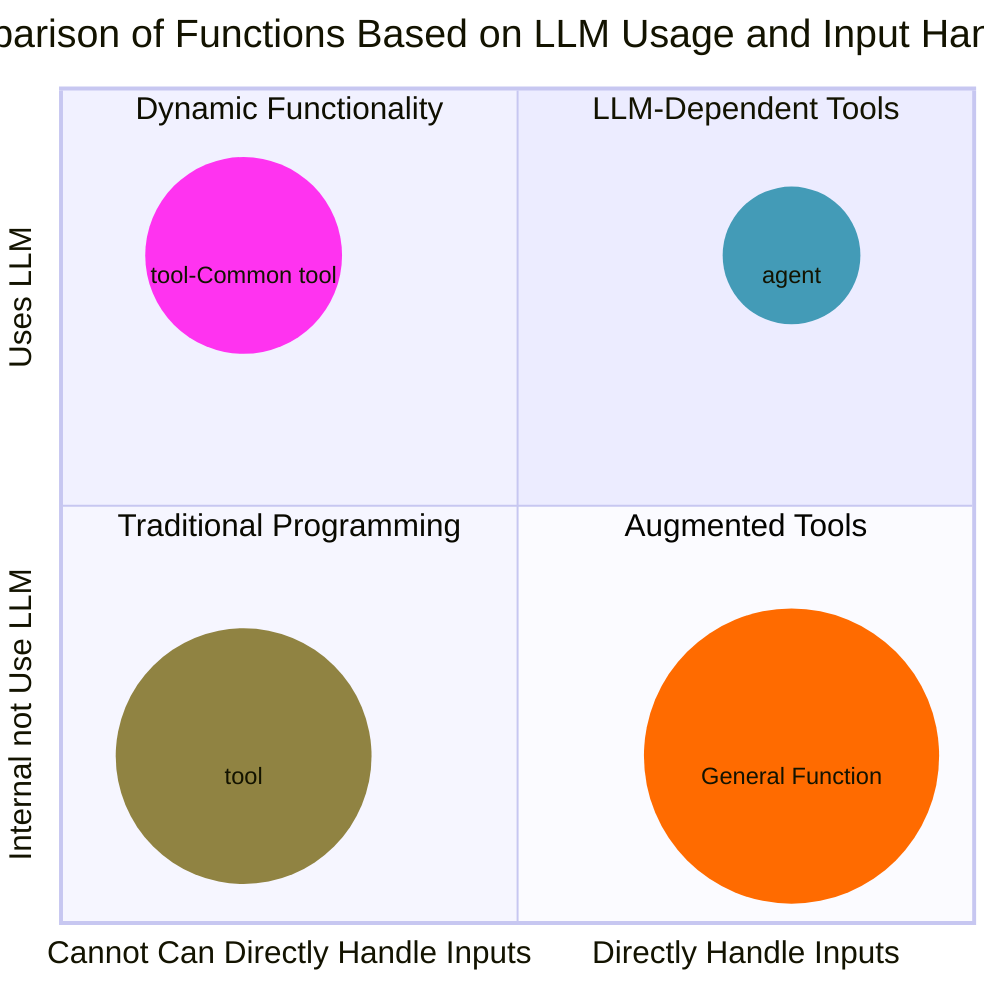

# `@tool` 裝飾器

## 概述

`@tool` 是一個 Python 裝飾器，用於將函數標記為工具函數。工具的核心邏輯可以與大型語言模型 (LLM) 有關，也可以完全獨立於 LLM。例如，爬蟲工具可以不依賴 LLM，而以文生圖工具可能需要利用 LLM 來生成其參數。

由於 `@tool` 和 `@agent` 都是裝飾器且自帶 LLM 客戶端，兩者經常被混淆。最大的區別在於：

1. **`@agent`**：用於內部核心邏輯主要依賴 LLM 的任務，並且具有明確的輸入與輸出。
2. **`@tool`**：內部核心邏輯未必依賴 LLM，但通過 LLM 來生成工具所需的參數。

此外，`@tool` 與 `tool calls` 的運作模式也有所不同：

- **`tool calls`**：需要嚴格定義函數調用場景，可能在特定情況下無法觸發。
- **`@tool`**：無需定義喚醒邏輯，適合自動化應用場景，且每次調用時一定執行。

---

## 功能與設計

1. **引數生成**：通過 LLM 生成工具所需的參數，提供靈活性和動態性。
2. **結構化輸出**：支持強類型的輸入與輸出，確保數據一致性。
3. **多功能應用**：既可用於純計算工具，也可用於與 LLM 整合的工具。

### 與 `@agent` 的差異

- `@agent` 的核心邏輯主要基於 LLM，適用於需要頻繁調用的最小任務單元。
- `@tool` 的核心邏輯可能完全獨立於 LLM，而是利用 LLM 生成其所需的參數，適合更廣泛的應用場景。

### 與 `tool calls` 的差異

- **`tool calls`**：需要明確定義函數喚醒的條件，可能存在無法觸發的情況。
- **`@tool`**：每次調用時無條件執行，避免喚醒失敗，適合自動化應用場景。

---

## 類別與函數說明

以下是 `@tool` 裝飾器的主要參數和函數說明：

### `@tool` 裝飾器

#### 引數

- **`model`** (`str`, 必填)：指定使用的 LLM 模型名稱，例如 `"gpt-4"`。
- **`system_prompt`** (`str`, 選填)：提供給 LLM 的系統提示語，用於設定工具的背景角色。默認為 `"你是一個擅長工具調用的超級幫手"`。
- **`temperature`** (`float`, 選填)：生成內容的隨機性參數，默認為 `0.7`。
- **`stream`** (`bool`, 選填)：是否以流式輸出生成結果。
- **`kwargs`**：其他可選參數，用於擴展功能。

#### 功能

- 設置工具名稱與描述，便於調用和管理。
- 動態生成函數所需的參數，並自動執行函數。
- 如果設置了 LLM 的相關參數，則會初始化並調用 LLM 客戶端。

### 類別 `BaseTool`

#### 說明

`BaseTool` 是 `@tool` 裝飾器的核心實現類別，負責 LLM 客戶端初始化、引數生成與工具函數的調用。

#### 方法

1. **`__init__`**
   
   - 初始化工具的基本屬性，包括模型名稱、系統提示語和溫度參數。
   - **參數**：
     - `model` (`str`): 指定使用的 LLM 模型名稱。
     - `system_prompt` (`str`): 工具的系統提示語。
     - `temperature` (`float`): 生成隨機性控制參數。
     - `kwargs`: 額外參數。
2. **`generate_tool_args`**
   
   - 基於工具名稱、docstring 和用戶提供的上下文引數，透過 LLM 生成最終的工具引數。
   - **參數**：
     - `tool_name` (`str`): 工具名稱。
     - `docstring` (`str`): 工具的 docstring 描述。
     - `input_kwargs` (`dict`): 用戶輸入的上下文引數。
   - **返回**：
     - 生成的工具引數（`dict`）。
3. **`__call__`**
   
   - 收集上下文信息，生成工具引數，並調用對應的工具函數。
   - **參數**：
     - `input_kwargs` (`dict`): 用戶輸入的引數。
   - **返回**：
     - 工具函數的執行結果。

---

## 使用範例

### 範例 1：不依賴 LLM 的工具，用於生成公司投資建議

```python
from paradoxism.tools import tool

@tool(model="gpt-4", system_prompt="生成公司投資建議")
def generate_investment_recommendation(company_name: str, target_price: float) -> str:
    """
    Args:
        company_name (str): 上市上櫃公司名稱。
        target_price (float): 投資目標價格。

    Returns:
        str: 包含公司名稱與投資目標價格的建議。
    """
    return f"公司 {company_name} 的投資目標價格為 {target_price} 元。"

# 調用範例
input_kwargs = {"news": "台積電（TSMC）作為全球領先的半導體製造公司，近期在市場上的表現再度引起廣泛關注。根據最新的外資報告，台積電的目標價被調升至1,600元。這一調整反映了市場對其未來成長潛力的高度期待，尤其是在AI需求強勁的背景下，台積電被視為主要受益者之一這些調整顯示出投資者對台積電未來業績的樂觀預期"}
recommendation = generate_investment_recommendation(input_kwargs)
print(recommendation)  # 輸出如："公司 TSMC 的投資目標價格為 1600 元。"
```

### 範例 2：依賴 LLM 的工具

```python
from paradoxism.tools import tool

@tool(model="gpt-4", system_prompt="總結文字內容")
def summarize(text: str) -> str:
    """
    Args:
        text (str): 需要總結的文字。

    Returns:
        str: 總結後的文字。
    """
    return "這是摘要功能，返回摘要內容。"

# 調用範例
summary = summarize({"text": "這是一段需要總結的長文……"})
```

---

## 效能與應用場景

### 效能

- 支持多次重用，並通過引數檢查和類型轉換提高安全性。
- 如果工具依賴 LLM，則自動記錄性能數據，便於後續分析。

### 應用場景

- 自動化處理：如數據清洗、格式轉換。
- 動態生成：依賴 LLM 的任務，如生成文本、生成圖片參數。
- 複雜管道：作為更大系統中的組件，輔助完成子任務。

---

`@tool` 裝飾器通過靈活的設計，滿足不同類型的工具需求。不論是依賴 LLM 還是純粹的計算工具，都能輕鬆集成，提升自動化能力和代碼的可讀性。



