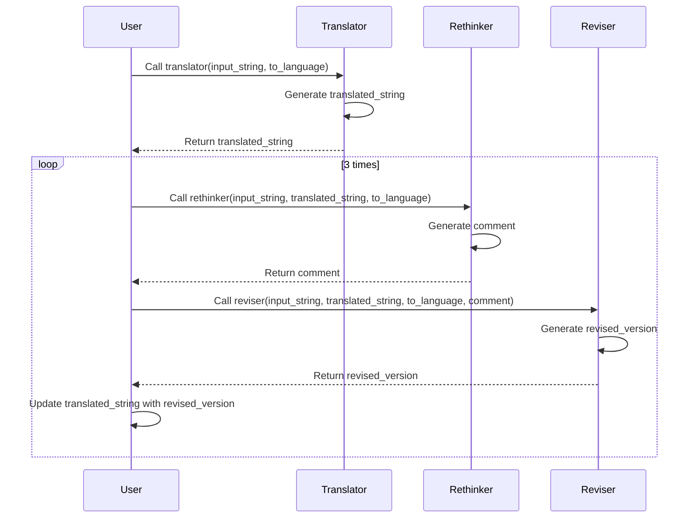

### 翻譯大師:案例說明與教程

#### 案例背景

這個案例展示了一個多語言翻譯系統，該系統使用 OpenAI 的 GPT-4 模型來進行翻譯、檢討和修訂。系統包含三個主要功能：

1. **翻譯**：將輸入的文字翻譯成指定語言。
2. **檢討**：對翻譯結果進行檢討，提供改進建議。
3. **修訂**：根據檢討意見對翻譯結果進行修訂。

#### 主要功能

1. **翻譯功能 (`translator`)**

   - 使用 GPT-4 模型進行翻譯。
   - 系統提示設置為多國語言翻譯專家。
2. **檢討功能 (`rethinker`)**

   - 使用 GPT-4 模型對翻譯結果進行檢討。
   - 系統提示設置為具有 30 年口譯經驗的專家。
3. **修訂功能 (`reviser`)**

   - 使用 GPT-4 模型根據檢討意見對翻譯結果進行修訂。
   - 系統提示設置為多國語言翻譯專家。

#### 重要觀念

`@agent` 是一個裝飾器，用來標記一個函數為代理任務的最小單位。它會初始化一個 `LLMClient` 實例，並將其與被裝飾的函數綁定。這樣，當函數被調用時，它可以使用 `LLMClient` 來生成語言模型的回應。

`prompt` 函數則是用來向語言模型發送請求並獲取回應的函數。它會根據提供的提示詞（prompt）生成相應的回應。

以下是 `@agent` 裝飾器和 `prompt` 函數的角色說明：

```python
from paradoxism.base.agent import agent
from paradoxism.ops.base import prompt

@agent(model='gpt-4o', system_prompt='你是一個擅長多國語言的的翻譯高手，你懂得根據輸入內容的原意與語境，在最大程度保留原本文字的風格與言外之意的情況下，翻譯成兼具信達雅的指定語種版本')
```

def translator(input_string, to_language):
"""
翻譯功能，使用 GPT-4 模型將輸入的文字翻譯成指定語言。

```
:param input_string: 要翻譯的原文。
:param to_language: 目標語言。
:return: 翻譯後的文字。
"""
translated_result = prompt(f'請將以下內容翻譯成{to_language}，直接輸出，無須解釋:\n\n"""{input_string}"""')
return translated_result
```

@agent 裝飾器：
參數：
model：指定使用的模型名稱，例如 'gpt-4o'。
system_prompt：系統提示詞，用於設置語言模型的角色和行為。

功能：
初始化 LLMClient 實例並綁定到被裝飾的函數。
在函數調用時，使用 LLMClient 來生成語言模型的回應。

prompt 函數：
參數：
prompt：用於生成回應的提示詞。

功能：
向語言模型發送請求並獲取回應。
使用方法

## 導入必要的模組

**需先於環境變數OPENAI-API-KEY中設置合法金鑰**

```python
from paradoxism.base.agent import agent
from paradoxism.ops.base import prompt
from paradoxism.utils import *
```

## 定義翻譯功能

```python
@agent(model='gpt-4o', system_prompt='你是一個擅長多國語言的的翻譯高手，你懂得根據輸入內容的原意與語境，在最大程度保留原本文字的風格與言外之意的情況下，翻譯成兼具信達雅的指定語種版本')
def translator(input_string, to_language):
translated_result = prompt(f'請將以下內容翻譯成{to_language}，直接輸出，無須解釋:\n\n"""{input_string}"""')
return translated_result

```


## 定義反思功能

```python
@agent(model='gpt-4o', system_prompt='你是一個30年口譯經驗的專家')
def rethinker(input_string, translated_string, to_language):
"""
檢討功能，使用 GPT-4 模型對翻譯結果進行檢討。
:param input_string: 原文。
:param translated_string: 翻譯後的文字。
:param to_language: 目標語言。
:return: 檢討意見。
"""
comment = prompt(f'以下兩段文字，第一段是原文，第二段是翻譯為{to_language}的譯文，請你針對這樣的翻譯是否還有可以更精進優化的空間給予具體的改進意見，以及那些是你覺得值得讚賞的優秀之處?你只提出觀點與看法，不要提供整份調整後譯文\n\n"""{input_string}"""\n\n"""{translated_string}"""')
return comment
```


## 定義修訂功能

```python

@agent(model='gpt-4o', system_prompt='你是一個擅長多國語言的的翻譯高手，你懂得根據輸入內容的原意與語境，在最大程度保留原本文字的風格與言外之意的情況下，翻譯成兼具信達雅的指定語種版本')
def reviser(input_string, translated_string, to_language, comment):
"""
修訂功能，使用 GPT-4 模型根據檢討意見對翻譯結果進行修訂。
:param input_string: 原文。
:param translated_string: 翻譯後的文字。
:param to_language: 目標語言。
:param comment: 檢討意見。
:return: 修訂後的文字。
"""
revised_version = prompt(f'以下三段文字，第一段是原文，第二段是翻譯為{to_language}的譯文，以及第三段是其他翻譯專家針對這次翻譯給予的改進建議以及讚賞，請根據上述專家意見，將譯文進行修改與調整，優點處請務必保留，缺點處則需要調整，未提及之處則視狀況保留或是修正，以求兼具信達雅，直接輸出，無須解釋!!\n\n"""{input_string}"""\n\n"""{translated_string}"""\n\n"""{comment}"""')
return revised_version
```


## 完整翻譯流程

```python
def full_translate(input_string, to_language):
print(f'Original:\n{input_string}')
translated_string = translator(input_string, to_language)
n = 1
print(blue_color(f'Version {n}:\n{translated_string}'))
for _ in range(3):
comment = rethinker(input_string, translated_string, to_language)
print(f'Version {n} comment:\n{comment}')
revised_version = reviser(input_string, translated_string, to_language, comment)
print(blue_color(f'Version {n+1} :\n{revised_version}'))
translated_string = revised_version
n += 1
```


### Sequence Diagram



### 測試範例

```
input_string_zh = '昨夜雨疏風驟，濃睡不消殘酒。試問卷簾人，卻道海棠依舊。知否，知否？應是綠肥紅瘦'

input_string_en = """To dissimulate is to feign not to have what one has. To simulate is to feign to have what one hasn't. One implies a presence, the other an absence. But the matter is more complicated, since to simulate is not simply to feign: "Someone who feigns an illness can simply go to bed and pretend he is ill. Someone who simulates an illness produces in himself some of the symptoms" (Littre). Thus, feigning or dissimulating leaves the reality principle intact: the difference is always clear, it is only masked; whereas simulation threatens the difference between "true" and "false", between "real" and "imaginary". Since the simulator produces "true" symptoms, is he or she ill or not? The simulator cannot be treated objectively either as ill, or as not ill. Psychology and medicine stop at this point, before a thereafter undiscoverable truth of the illness. For if any symptom can be "produced," and can no longer be accepted as a fact of nature, then every illness may be considered as simulatable and simulated, and medicine loses its meaning since it only knows how to treat "true" illnesses by their objective causes. Psychosomatics evolves in a dubious way on the edge of the illness principle. As for psychoanalysis, it transfers the symptom from the organic to the unconscious order: once again, the latter is held to be real, more real than the former; but why should simulation stop at the portals of the unconscious? Why couldn't the "work" of the unconscious be "produced" in the same way as any other symptom in classical medicine? Dreams already are."""

full_translate(input_string_zh, to_language='en-US')
full_translate(input_string_zh, to_language='jp-JP')
full_translate(input_string_en, to_language='zh-TW')
```
